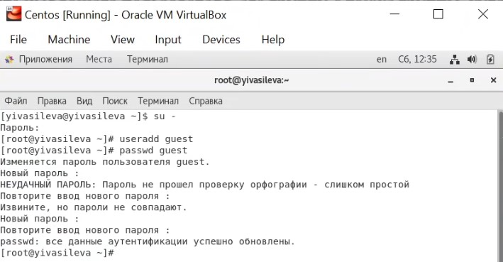

##Российский университет дружбы народов
###Факультет физико-математических и естественных наук
#ОТЧЕТ по лабораторной работе №2
##дисциплина:	Информационная безопасность
####Студент: Васильева Юлия
####Группа: НФИбд-03-18
###МОСКВА 2021г.
***
##Цель работы
Получение практических навыков работы в консоли с атрибутами файлов, закрепление теоретических основ дискреционного разграничения доступа в современных системах с открытым кодом на базе ОС Linux1.
##Выполнение лабораторной работы
1. В установленной при выполнении предыдущей лабораторной работы
операционной системе создали учётную запись пользователя guest (использовали учётную запись администратора): useradd guest.
2. Задали пароль для пользователя guest: passwd guest.

3. Вошли в систему от имени пользователя guest.
4. Определили директорию, в которой находимся, командой pwd. Сравнили её с приглашением командной строки. Они одинаковы. Данная папка является домашней директорией.
5. Уточнили имя нашего пользователя командой whoami. Пользователь: guest.
6. Уточнили имя нашего пользователя, его группу, а также группы, куда входит пользователь, командой id. uid и gid равны 1001. Команда groups вывела имя пользователя guest.

7. Сравнили полученную информацию об имени пользователя с данными,
выводимыми в приглашении командной строки. Они одинаковы.
8. Просмотрели файл /etc/passwd командой
cat /etc/passwd.
Нашли в нём свою учётную запись с помощью команды cat /etc/passwd | grep guest. Определили uid и gid пользователя. Они так же равны 1001.
9. Определили существующие в системе директории командой
ls -l /home/.
Удалось получить список поддиректорий директории /home. На директориях установлены полные права для владельца.
10. На поддиректориях не установлены расширенные атрибуты. Удалось открыть список директорий с их атрибутами только для пользователя guest.
11. Создали в домашней директории поддиректорию dir1 командой
mkdir dir1.
Определили командами ls -l и lsattr, какие права доступа и расширенные атрибуты были выставлены на директорию dir1.

              
12. Сняли с директории dir1 все атрибуты командой
chmod 000 dir1
и проверили с её помощью правильность выполнения команды
ls -l.

    
13. Попытались создать в директории dir1 файл file1 командой
echo "test" > /home/guest/dir1/file1
Мы не смогли создать файл, так как мы сняли права с директории на любые действия с ней.
Файл не был создан, это мы проверили командой
ls -l /home/guest/dir1.

                      
14. Заполнили таблицу «Установленные права и разрешённые действия»
(см. табл. 2.1), выполняя действия от имени владельца директории (файлов), определив опытным путём, какие операции разрешены, а какие нет.
Если операция разрешена, занесли в таблицу знак «+», если не разрешена, знак «-».

15. На основании заполненной таблицы определили те или иные минимально необходимые права для выполнения операций внутри директории dir1, заполнили табл. 2.2.

##Вывод

Мы получили практические навыки работы в консоли с атрибутами файлов, закрепили теоретические основы дискреционного разграничения доступа в современных системах с открытым кодом на базе ОС Linux1.