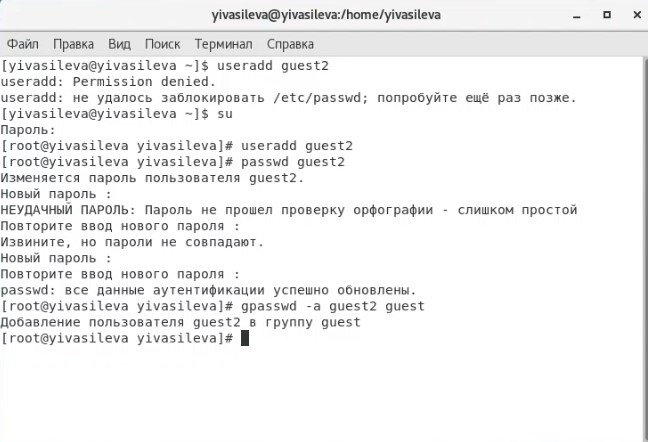
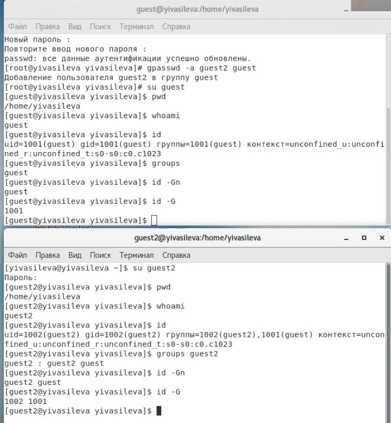
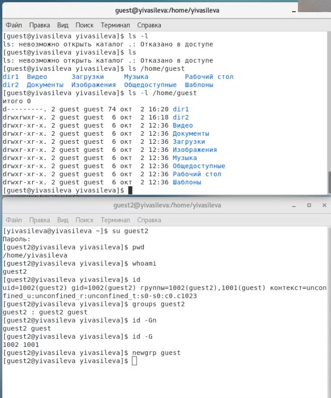

##Российский университет дружбы народов
###Факультет физико-математических и естественных наук
#ОТЧЕТ по лабораторной работе №3
##дисциплина:	Информационная безопасность
####Студент: Васильева Юлия
####Группа: НФИбд-03-18
###МОСКВА 2021г.
***
##Цель работы
Получение  практических  навыков  работы  в  консоли  с  атрибутами  файлов для групп пользователей.
##Выполнение лабораторной работы
1. В установленной операционной системе создайте учётную запись пользователя guest (использую учётную запись администратора):
useradd guest
2. Задайте пароль для пользователя guest (использую учётную запись администратора):
passwd guest
3. Аналогично создайте второго пользователя guest2
4. Добавьте пользователя guest2 в группу guest:
gpasswd -a guest2 guest

            
5. Осуществите вход в систему от двух пользователей на двух разных кон- солях: guest на  первой консоли и  guest2  на  второй консоли.    
6. Для обоих пользователей командой pwd определите директорию, в кото- рой вы находитесь. Сравните её  с  приглашениями командной строки.        
7. Уточните имя вашего пользователя, его группу, кто входит в неё и к каким группам принадлежит он сам. Определите командами groups guest и groups guest2, в какие группы входят пользовате- ли guest и guest2. Сравните вывод команды groups с выводом команд id -Gn и id -G.

              
8. Сравните полученную информацию с содержимым файла /etc/group. Просмотрите файл командой
cat /etc/group         
9. От имени пользователя guest2 выполните регистрацию пользователя guest2  в группе guest командой
newgrp guest          
10. От имени пользователя guest измените права директории /home/guest, разрешив все действия для пользователей группы:
chmod g+rwx /home/guest           
11. От имени пользователя guest снимите с директории /home/guest/dir1 все  атрибуты командой
chmod 000 dirl
и проверьте правильность снятия атрибутов.

##Вывод

Мы получили практические навыки работы в консоли с атрибутами файлов для групп пользователей.