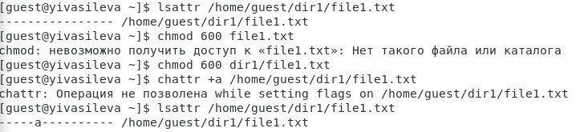
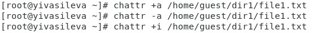
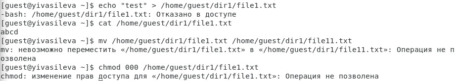

##Российский университет дружбы народов
###Факультет физико-математических и естественных наук
#ОТЧЕТ по лабораторной работе №4
##дисциплина:	Информационная безопасность
####Студент: Васильева Юлия
####Группа: НФИбд-03-18
###МОСКВА 2021г.
***
##Цель работы
Получение  практических  навыков  работы  в  консоли  с  расширенными атрибутами файлов.
##Выполнение лабораторной работы
1. От имени пользователя guest определите расширенные атрибуты файла /home/guest/dir1/file1 командой:
lsattr /home/guest/dir1/file1.
2. Установите командой chmod 600 file1 на файл file1 права, разрешающие чтение и запись для владельца файла.
3. Попробуйте установить на файл /home/guest/dir1/file1 расширенный атрибут a от имени пользователя guest:
chattr +a /home/guest/dir1/file1.
В ответ вы должны получить отказ от выполнения операции.
4. Зайдите на третью консоль с правами администратора либо повысьте свои права с помощью команды su. Попробуйте установить расширенный атрибут a на файл /home/guest/dir1/file1 от имени суперпользователя:
chattr +a /home/guest/dir1/file1.          
5. От пользователя guest проверьте правильность установления атрибута:
lsattr /home/guest/dir1/file1.                        

6. Выполните дозапись в файл  file1  слова «test» командой echo "test" /home/guest/dir1/file1.
После этого выполните чтение файла file1 командой cat /home/guest/dir1/file1.
Убедитесь, что слово test было успешно записано в file1.       
7. Попробуйте удалить файл file1 либо стереть имеющуюся в нём информацию командой echo "abcd" > /home/guest/dirl/file1. Попробуйте переименовать файл.             
8. Попробуйте с  помощью команды chmod 000 file1 установить на файл file1 права, например, запрещающие чтение и запись для владельца файла. Удалось ли вам успешно выполнить указанные команды?
Результат: не удалось.       
      
9. Снимите расширенный атрибут a с файла /home/guest/dirl/file1 от имени суперпользователя командой chattr -a  /home/guest/dir1/file1.
Повторите операции, которые вам ранее не удавалось выполнить.      
     
    
10. Повторите ваши действия по шагам, заменив атрибут «a» атрибутом «i». Удалось ли вам дозаписать информацию в файл?

Результат: не удалось.

##Вывод

В результате выполнения работы мы повысили свои навыки использования интерфейса командой строки (CLI), познакомились на примерах с тем, как используются основные и расширенные атрибуты при разграничении доступа. Имели возможность связать теорию дискреционного разделения доступа (дискреционная политика безопасности) с её реализацией на практике в ОС Linux. Составили наглядные таблицы, поясняющие какие операции возможны при тех или иных установленных правах. Опробовали действие на практике расширенных атрибутов «а» и «i».