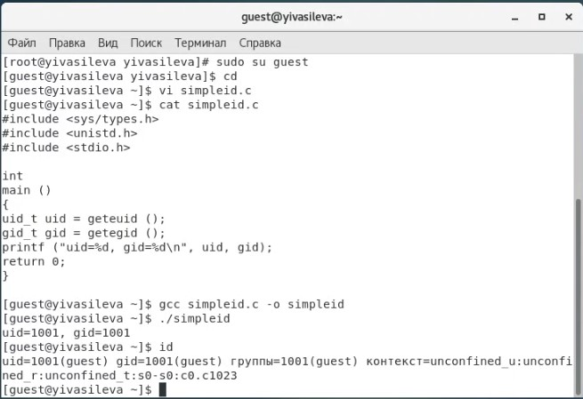
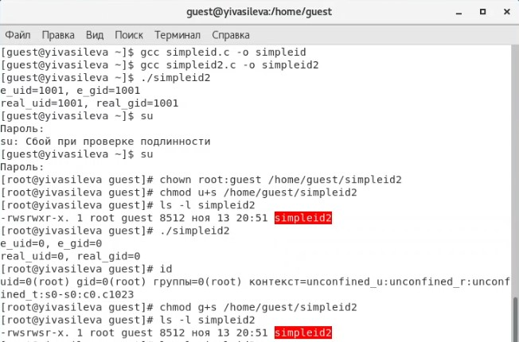
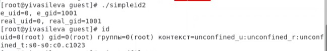
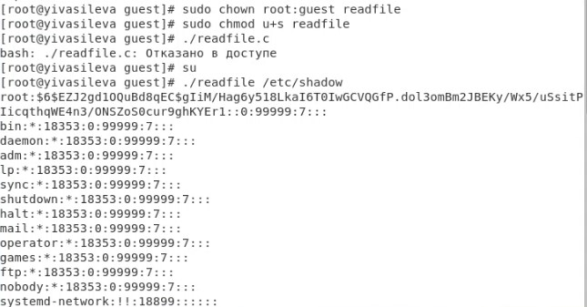
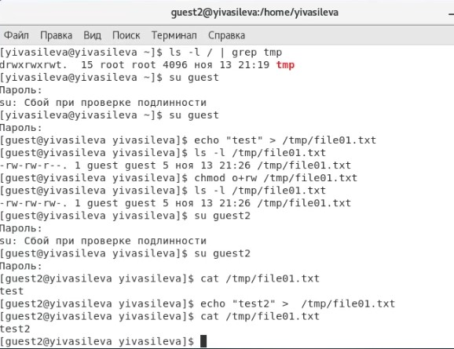
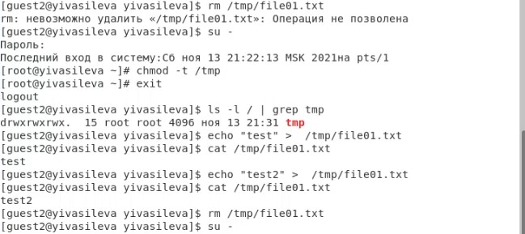

##Российский университет дружбы народов
###Факультет физико-математических и естественных наук
#ОТЧЕТ по лабораторной работе №5
##дисциплина:	Информационная безопасность
####Студент: Васильева Юлия
####Группа: НФИбд-03-18
###МОСКВА 2021г.
***
##Цель работы
Изучение механизмов изменения идентификаторов, применения
SetUID- и Sticky-битов. Получение практических навыков работы в консоли с дополнительными атрибутами. Рассмотрение работы механизма
смены идентификатора процессов пользователей, а также влияние бита
Sticky на запись и удаление файлов.

##Выполнение лабораторной работы

1. Войдите в систему от имени пользователя guest.
2. Создайте программу simpleid.c:

	include <sys/types.h>   
	include <unistd.h>   
	include <stdio.h>   
	int   
	main ()   
	{  
	uid_t uid = geteuid ();   
	gid_t gid = getegid ();   
	printf ("uid=%d, gid=%d\n", uid, gid);   
	return 0;   
	}    
3. Скомплилируйте программу и убедитесь, что файл программы создан:
gcc simpleid.c -o simpleid    
4. Выполните программу simpleid:
./simpleid
5. Выполните системную программу id
и сравните полученный вами результат с данными предыдущего пункта
задания.   
       
Данные одинаковы.      
6. Усложните программу, добавив вывод действительных идентификаторов:   
	include <sys/types.h>   
	include <unistd.h>   
	include <stdio.h>   
	int   
	main ()   
	{   
	uid_t real_uid = getuid ();   
	uid_t e_uid = geteuid ();   
	gid_t real_gid = getgid ();   
	gid_t e_gid = getegid () ;   
	printf ("e_uid=%d, e_gid=%d\n", e_uid, e_gid);   
	printf ("real_uid=%d, real_gid=%d\n", real_uid,   
	,→ real_gid);   
	return 0;   
	}     
Получившуюся программу назовите simpleid2.c.  
7. Скомпилируйте и запустите simpleid2.c:   
gcc simpleid2.c -o simpleid2   
./simpleid2   
8. От имени суперпользователя выполните команды:   
chown root:guest /home/guest/simpleid2   
chmod u+s /home/guest/simpleid2   
9. Используйте sudo или повысьте временно свои права с помощью su.
Поясните, что делают эти команды.   
10. Выполните проверку правильности установки новых атрибутов и смены
владельца файла simpleid2:   
ls -l simpleid2   
11. Запустите simpleid2 и id:   
./simpleid2   
id   
Сравните результаты.   
     
12. Проделайте тоже самое относительно SetGID-бита.   
   
13. Создайте программу readfile.c:   
	include <fcntl.h>   
	include <stdio.h>   
	include <sys/stat.h>   
	include <sys/types.h>   
	include <unistd.h>   
	int   
	main (int argc, char* argv[])   
	{   
	unsigned char buffer[16];   
	size_t bytes_read;   
	int i;   
	int fd = open (argv[1], O_RDONLY);   
	do   
	{   
	bytes_read = read (fd, buffer, sizeof (buffer));   
	for (i =0; i < bytes_read; ++i) printf("%c", buffer[i]);   
	}   
	while (bytes_read == sizeof (buffer));   
	close (fd);   
	return 0;   
	}     
14. Откомпилируйте её.   
gcc readfile.c -o readfile   
15. Смените владельца у файла readfile.c (или любого другого текстового
файла в системе) и измените права так, чтобы только суперпользователь
(root) мог прочитать его, a guest не мог.   
16. Проверьте, что пользователь guest не может прочитать файл readfile.c.   
17. Смените у программы readfile владельца и установите SetU’D-бит.   
18. Проверьте, может ли программа readfile прочитать файл readfile.c? Может      
19. Проверьте, может ли программа readfile прочитать файл /etc/shadow?  Может    
     

##5.3.2. Исследование Sticky-бита   
1. Выясните, установлен ли атрибут Sticky на директории /tmp, для чего
выполните команду     
ls -l / | grep tmp  
2. От имени пользователя guest создайте файл file01.txt в директории /tmp
со словом test:    
echo "test" > /tmp/file01.txt    
3. Просмотрите атрибуты у только что созданного файла и разрешите чтение и запись для категории пользователей «все остальные»:   
ls -l /tmp/file01.txt    
chmod o+rw /tmp/file01.txt   
ls -l /tmp/file01.txt   
4. От пользователя guest2 (не являющегося владельцем) попробуйте прочитать файл /tmp/file01.txt:    
cat /tmp/file01.txt   
5. От пользователя guest2 попробуйте дозаписать в файл 
/tmp/file01.txt слово test2 командой   
echo "test2" > /tmp/file01.txt   
Удалось ли вам выполнить операцию?   
6. Проверьте содержимое файла командой   
cat /tmp/file01.txt   
7. От пользователя guest2 попробуйте записать в файл /tmp/file01.txt
слово test3, стерев при этом всю имеющуюся в файле информацию командой
echo "test3" > /tmp/file01.txt   
Удалось ли вам выполнить операцию?    Да   
8. Проверьте содержимое файла командой   
cat /tmp/file01.txt   
   
9. От пользователя guest2 попробуйте удалить файл /tmp/file01.txt командой
rm /tmp/fileOl.txt   
Удалось ли вам удалить файл?   Нет   
10. Повысьте свои права до суперпользователя следующей командой
su -   
и выполните после этого команду, снимающую атрибут t (Sticky-бит) с
директории /tmp:   
chmod -t /tmp   
11. Покиньте режим суперпользователя командой
exit   
12. От пользователя guest2 проверьте, что атрибута t у директории /tmp
нет:   
ls -l / | grep tmp   
13. Повторите предыдущие шаги. Какие наблюдаются изменения?   
14. Удалось ли вам удалить файл от имени пользователя, не являющегося
его владельцем? Удалось. 
15. Повысьте свои права до суперпользователя и верните атрибут t на директорию /tmp:   
su -   
chmod +t /tmp   
exit   
   

##Вывод

Мы изучили механизмы изменения идентификаторов, применения
SetUID- и Sticky-битов. Получили практические навыки работы в консоли с дополнительными атрибутами. Рассмотрели работу механизма
смены идентификатора процессов пользователей, а также влияние бита
Sticky на запись и удаление файлов.