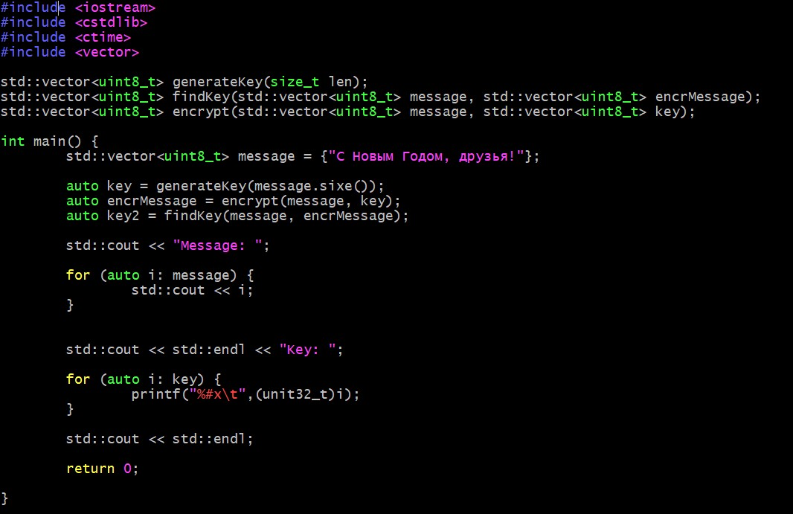
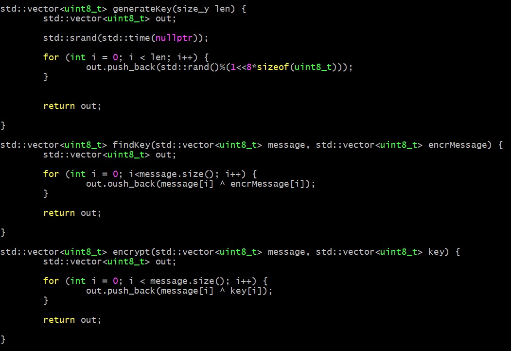
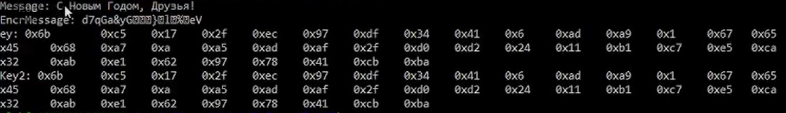

##Российский университет дружбы народов
###Факультет физико-математических и естественных наук
#ОТЧЕТ по лабораторной работе №7
##дисциплина:	Информационная безопасность
####Студент: Васильева Юлия
####Группа: НФИбд-03-18
###МОСКВА 2021г.
***
##Цель работы
Освоить на практике применение режима однократного гаммирования.​

##Выполнение лабораторной работы

1. Определить вид шифротекста при известном ключе и известном открытом тексте.​
2. Определить ключ, с помощью которого шифротекст может быть преобразован в некоторый фрагмент текста, представляющий собой один из возможных вариантов прочтения открытого текста.​   
   
   
   

##Вывод

Мы освоили на практике применение режима однократного гаммирования.​